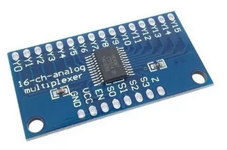
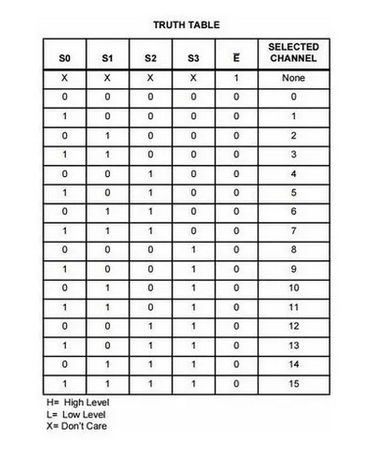

# mux

Tem como objetivo fazer a leitura das 64 casas do tabuleiro em uma única saida

## hardware
O sistema compõe 4 mux 16:4 e cada mux realiza a leitura de duas linhas.


- Módulo Multiplexador CD74HC4067 Analógico Digital 16 Canais.

###


- Mapa de Karnaugh

## software

```cpp
const int seletor[][] = {{}}; //Seletores. Notação: LITTLE ENDIAN
```

- Conjuntos de seletores.

```cpp
const int SIG; //Pino de leitura analógica
```

- SIG.

```cpp
void buildSystem(void);
```

- Monta o sistema MUX.

```cpp
int returnPiece(int value_pin_seletor);
```

- Retorna a peça informando o valor analógico.

```cpp
void updateImageBoard(void);
```

- Atualiza a Imagem do tabuleiro.
